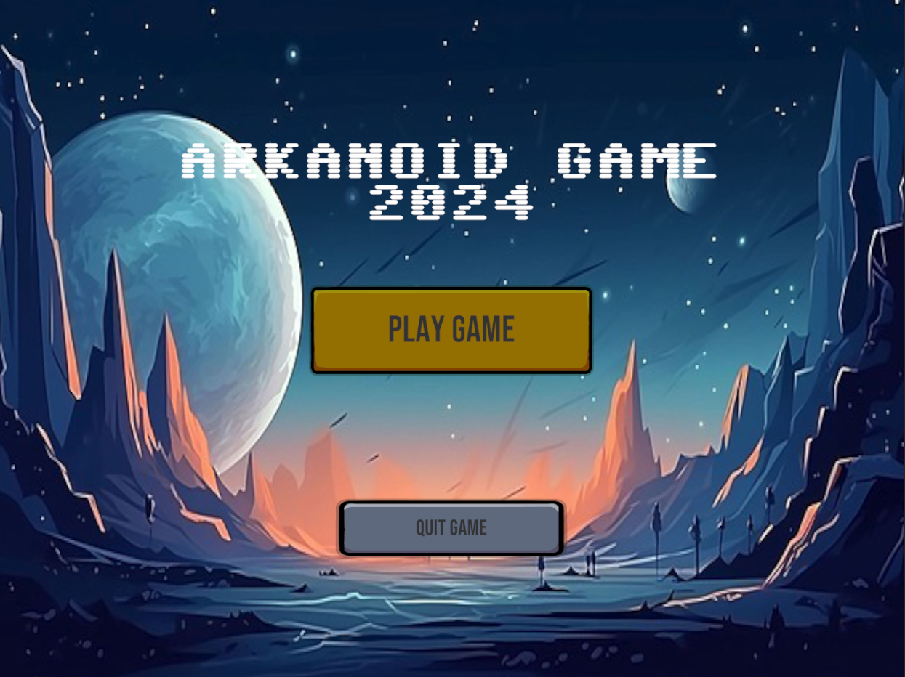
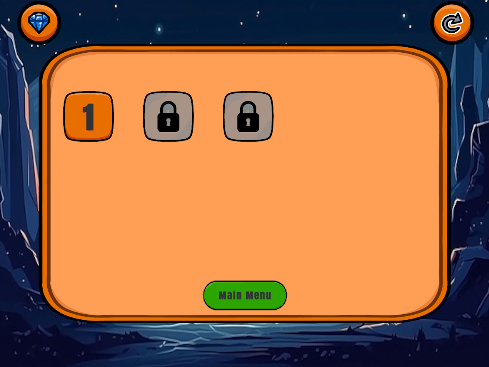
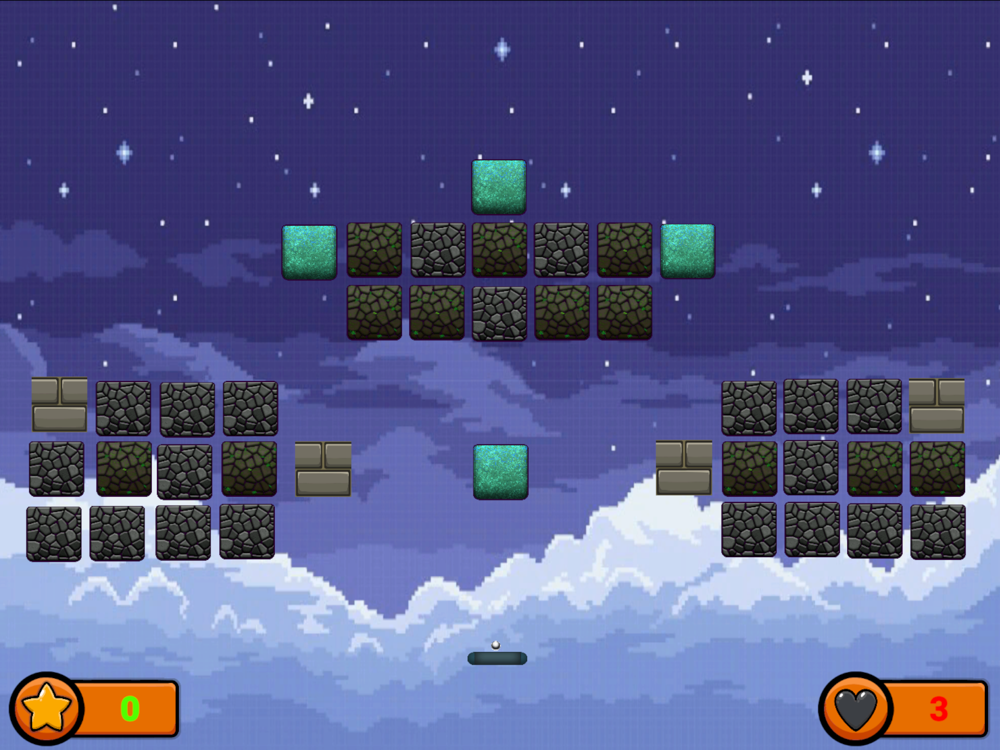
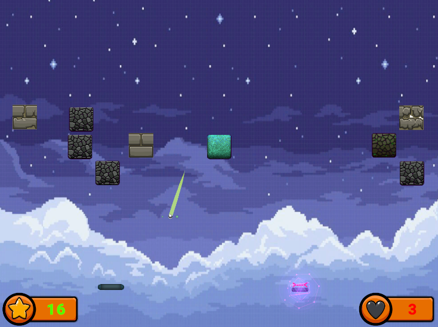

# ARKANOID GAME 🎮🚀
Arkanoid is a classic arcade-style game developed as a school project. The player controls a paddle to bounce a ball and break bricks, aiming to clear all bricks without letting the ball fall below the paddle.

# About the Game
- Control the paddle horizontally to keep the ball in play
- Bounce the ball to break bricks arranged in levels
- Avoid missing the ball, or you lose a life

    
    
    
    

# ✨ Game Features
- Lives system — you lose a life if the ball falls below the paddle
- Score tracking for bricks destroyed
- Bonus system (2 types of bonuses Good / Bad)
- Sound Effects System
- Particle Effects System
- Level System and Save System

📝 Planned goal: Create more levels, Add more bonuses, Make Leaderboard

<h1> <a href="https://dominikk27.itch.io/arkanoid-game">🖥️ Desktop Build </a></h1>